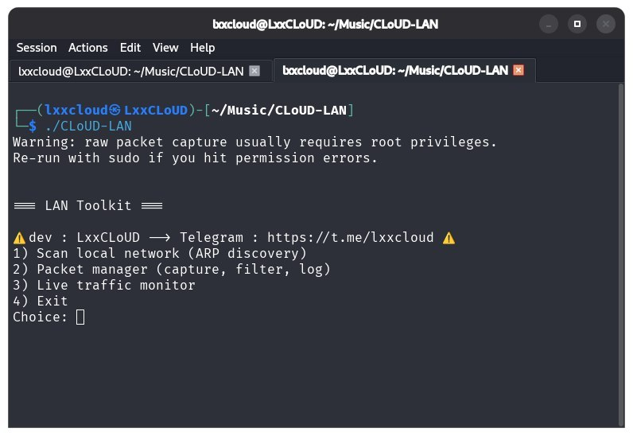

  
<h1 align="center"> ⬇️ Supplementary Tool ⬇️ </h1>
<h1 align="center"> https://github.com/The-Lxx-CLoUD/CLoUD-LAN </h1>

<p align="center">
<i> 🔥 CLoUD-LAN 🔥  </i>
</p>
    
<p align="center">
  
  
 
##  📃 Explanation : 
```text
ARP-based network scanner
packet manager, and live traffic monitor for a local network
written in C++17 using libpcap and raw sockets.
```
## ⚙️ Requirements :
- Linux
- g++ with C++17 support
- libpcap development headers

## 📩 Installation steps : 
- 1️⃣ Open the file :
```bash
cd CLoUD-LAN
```
- 2️⃣ Installing prerequisites :
```bash
sudo apt-get install build-essential libpcap-dev
```
- 3️⃣ Build // Compile :
```bash
make
```
This produces a binary called `CLoUD-LAN`.
- 4️⃣ Run Tool :
```bash
sudo ./CLoUD-LAN
```
##

### You'll get a menu :
```text
1. Scan local network — sends ARP requests across your subnet and lists every IP/MAC that replies.

2. Packet manager — captures live traffic on a chosen interface, optionally filtered with a BPF expression (e.g. ``tcp port 443''), prints each packet, and can save a CSV log.

3. Live traffic monitor — a refreshing dashboard showing packet/byte counts by protocol and top talkers by IP. Stop with Ctrl+C.
4. Exit.
```

## Notes
- Only use this against networks and devices you own or are authorized to test.
- The ARP scan assumes an IPv4 interface with a standard netmask; point-to-point or VPN interfaces may not work as expected.

